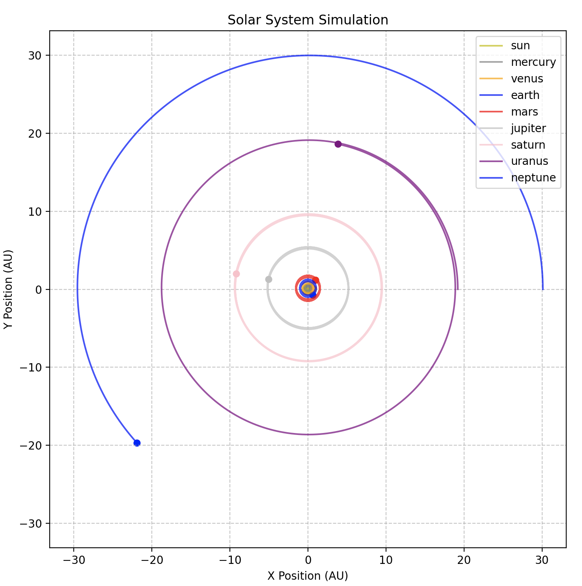

# Solar System Simulation

A Python implementation of an N-body gravitational simulation modeling planetary orbits using three numerical integration methods.

## Features
- Simulates planetary motion with Beeman, Euler-Cromer, and Direct Euler methods
- Tracks orbital periods and energy conservation
- Visualizes results with matplotlib

## Requirements
- Python 3.x
- NumPy
- Matplotlib

## Usage
1. Configure `parameters_solar.json`
2. Run `python solar_simulation.py`
3. Select integration method when prompted

## Methods Compared
- Beeman (recommended for stability)
- Euler-Cromer
- Direct Euler (demonstrates energy drift)

